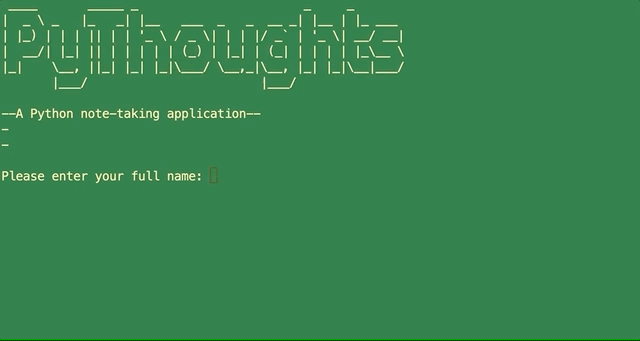

# PyThoughts
A Python note taking application in your command line.


## Use Instructions
- PyThoughts is a simple note taking application for use in your command line. To begin you will be prompted to enter your full name. If you have already used PyThoughts you will be greeted with a count of your total notes. 

- __CREATING A NEW NOTE__:  
To create a new note simply type in _create_ and hit enter. You will then be asked for a title for your note, and then you can write out the contents of your note. To submit your note hit enter and you'll see your completed note.
- __VIEWING YOUR NOTES__:  
To view the notes you've created type _view_ in the main menu when prompted. You will then be asked if you'd like to see a list of all notes or if you'd like to find a specific note. Finding a specific note requires the __ID__ of that note. Type that ID and hit enter to see that note.
- __DELETING AND EDITING NOTES__:  
To delete or edit an existing note first start by going to the __VIEW__ menu and then use the __FIND__ command to find the note you'd like to edit or delete. You will then be prompted to delete the note by typing _delete_ or edit the note by entering _edit_. 

## Installation Instructions
1. Clone this repo 
```
git clone git@github.com:TylerEikenberg/Python-Note-App.git
```
2. Install the required packages found in __Pipfile__  

3. In PSQL you'll need a database called __note__.  

4. Run the project 
```
pipenv run python note.py
```
### Technologies Used
- Python 3
- PostgreSQL